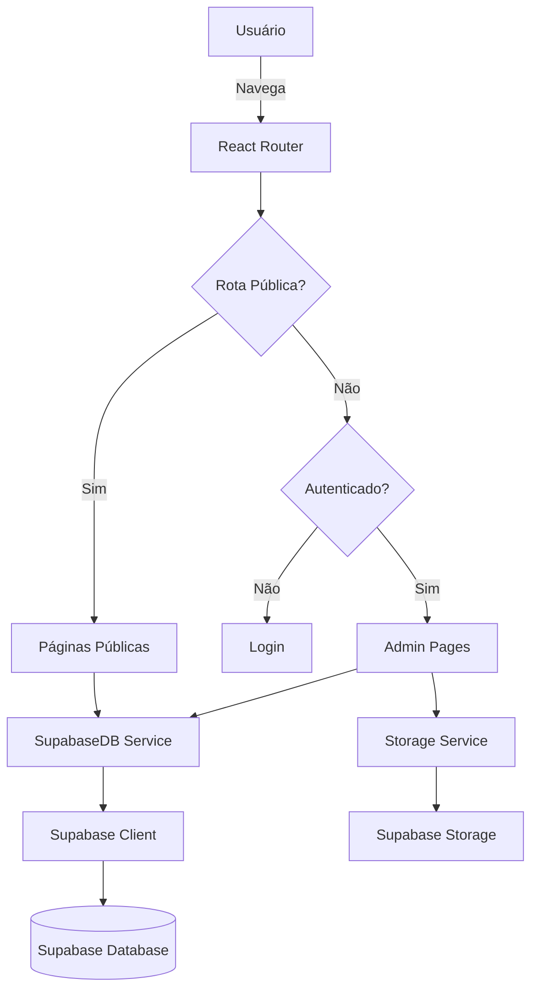

# CODM Loadouts Hub - Visão Geral do Projeto

## 📋 Resumo

**CODM Loadouts Hub** é uma plataforma web para compartilhar e descobrir loadouts (configurações de armas) de Call of Duty: Mobile dos seus streamers favoritos. O projeto permite que usuários copiem builds profissionais, vejam estatísticas e dominem o jogo.

## 🎯 Objetivo

Portal definitivo para loadouts de Call of Duty: Mobile com:
- Catálogo de streamers e suas builds
- Sistema de visualização de armas com vídeos
- Painel administrativo completo
- Design inspirado no visual do CODM (militar/tático)

---

## 🏗️ Arquitetura do Projeto

### Stack Tecnológica

| Categoria | Tecnologia | Versão |
|-----------|-----------|--------|
| **Frontend Framework** | React | 18.2.0 |
| **Build Tool** | Vite | 6.2.0 |
| **Linguagem** | TypeScript | 5.8.2 |
| **Roteamento** | React Router DOM | 6.22.3 |
| **Estilização** | TailwindCSS | via CDN |
| **Animações** | Framer Motion | 11.0.24 |
| **Ícones** | Lucide React | 0.363.0 |
| **Gráficos** | Recharts | 2.12.3 |
| **Backend/DB** | Supabase | 2.93.2 |

### Estrutura de Diretórios

```
CODM/
├── App.tsx                 # Componente principal com rotas
├── index.tsx              # Entry point
├── index.html             # HTML base com config Tailwind
├── types.ts               # Definições TypeScript
├── components/            # Componentes reutilizáveis
│   └── WeaponVisual.tsx  # Visualização de armas
├── pages/                 # Páginas da aplicação
│   ├── Home.tsx          # Página inicial
│   ├── StreamerList.tsx  # Lista de streamers
│   ├── StreamerProfile.tsx # Perfil do streamer
│   ├── LoadoutDetail.tsx # Detalhes do loadout
│   └── admin/            # Painel administrativo
│       ├── Dashboard.tsx
│       ├── Login.tsx
│       ├── Streamers.tsx
│       ├── Weapons.tsx
│       └── Loadouts.tsx
├── services/             # Camada de serviços
│   ├── supabase.ts      # Cliente Supabase
│   ├── db.ts            # Operações de banco de dados
│   └── storage.ts       # Upload de arquivos
├── constants/
│   └── gunsmith.ts      # Dados de acessórios de armas
└── supabase_schema.sql  # Schema do banco de dados
```

---

## 🗄️ Modelo de Dados

### Entidades Principais

#### 1. **Streamers**
```typescript
interface Streamer {
  id: string;
  name: string;
  slug: string;
  avatarUrl: string;
  videoUrl?: string;        // Vídeo de loop para miniatura
  videoPosX?: number;       // Posição horizontal (0-100)
  videoPosY?: number;       // Posição vertical (0-100)
  videoScale?: number;      // Escala do vídeo (0.5 - 2.0)
  bio: string;
  tags: string[];
  platforms: {
    youtube?: string;
    twitch?: string;
    tiktok?: string;
    instagram?: string;
    twitter?: string;
  };
  isActive: boolean;
}
```

#### 2. **Weapons** (Armas)
```typescript
interface Weapon {
  id: string;
  name: string;
  slug: string;
  category: WeaponCategory; // AR, SMG, Sniper, LMG, Shotgun, Marksman, Pistol, Melee
  imageUrl: string;
  videos: WeaponVideo[];    // Array de vídeos da arma
  isActive: boolean;
}

interface WeaponVideo {
  id: string;
  url: string;              // URL do mp4/webm
  isActive: boolean;
  createdAt: string;
}
```

#### 3. **Loadouts**
```typescript
interface Loadout {
  id: string;
  streamerId: string;
  weaponId: string;
  code: string;             // Código do loadout no jogo
  attachments: {
    muzzle?: string;
    barrel?: string;
    optic?: string;
    stock?: string;
    laser?: string;
    underbarrel?: string;
    ammo?: string;
    rear_grip?: string;
    perk?: string;
  };
  perks: {
    red: string;
    green: string;
    blue: string;
  };
  equipment: {
    lethal: string;
    tactical: string;
  };
  notes: string;
  publishedAt: string;
  stats: {
    views: number;
    copies: number;
  };
}
```

### Schema do Banco de Dados (Supabase)

```sql
-- Tabelas principais
- streamers (id, name, slug, avatar_url, video_url, bio, tags[], platforms jsonb, is_active)
- weapons (id, name, slug, category, image_url, videos jsonb[], is_active)
- loadouts (id, streamer_id, weapon_id, code, attachments jsonb, perks jsonb, equipment jsonb, notes, stats jsonb)
- app_users (id, email, name, role)

-- Políticas RLS (Row Level Security)
- Leitura pública para todas as tabelas
- Escrita apenas para admins
```

---

## 🎨 Design System

### Paleta de Cores (Tema CODM)

```javascript
codm: {
  yellow: '#fbbf24',        // Amarelo clássico do botão "INICIAR"
  yellow_hover: '#d97706',
  dark: '#0b0f15',          // Fundo quase preto
  panel: '#151b24',         // Painéis
  gray: '#94a3b8',
  accent: '#3b82f6'         // Azul tático
}

rarity: {
  mythic: '#ef4444',        // Vermelho
  legendary: '#f59e0b',     // Laranja/Dourado
  epic: '#a855f7',          // Roxo
  rare: '#3b82f6'           // Azul
}
```

### Tipografia

- **Fonte Principal**: Rajdhani (técnica/militar)
- **Fonte de Títulos**: Teko (estilo CODM)

### Elementos Visuais

- **Background**: Padrão diagonal com textura de ruído
- **Painéis**: Gradiente escuro com bordas sutis
- **Botões**: Efeito skew (-15deg) para visual tático
- **Scrollbar**: Customizada com tema militar

---

## 🔑 Funcionalidades Principais

### Área Pública

#### 1. **Home** ([Home.tsx](file:///Users/cristianzimermann/Docs/Projects/CODM/pages/Home.tsx))
- Hero section com título impactante
- Grid de streamers em destaque
- Loadouts em alta (trending)
- Filtros por categoria de arma

#### 2. **Lista de Streamers** ([StreamerList.tsx](file:///Users/cristianzimermann/Docs/Projects/CODM/pages/StreamerList.tsx))
- Cards com avatar/vídeo do streamer
- Tags e plataformas sociais
- Busca e filtros

#### 3. **Perfil do Streamer** ([StreamerProfile.tsx](file:///Users/cristianzimermann/Docs/Projects/CODM/pages/StreamerProfile.tsx))
- Informações do streamer
- Grid de loadouts
- Links para redes sociais

#### 4. **Detalhes do Loadout** ([LoadoutDetail.tsx](file:///Users/cristianzimermann/Docs/Projects/CODM/pages/LoadoutDetail.tsx))
- Visualização 3D da arma (vídeo)
- Lista completa de acessórios
- Perks e equipamentos
- Botão "Copiar Código"
- Estatísticas (views, copies)

### Área Administrativa

> **Acesso**: `/admin` (requer autenticação)

#### 1. **Dashboard** ([admin/Dashboard.tsx](file:///Users/cristianzimermann/Docs/Projects/CODM/pages/admin/Dashboard.tsx))
- Estatísticas gerais
- Gráficos de performance
- Resumo de conteúdo

#### 2. **Gerenciar Streamers** ([admin/Streamers.tsx](file:///Users/cristianzimermann/Docs/Projects/CODM/pages/admin/Streamers.tsx))
- CRUD completo
- Upload de avatar e vídeo
- Configuração de posicionamento de vídeo
- Gerenciar plataformas sociais

#### 3. **Gerenciar Armas** ([admin/Weapons.tsx](file:///Users/cristianzimermann/Docs/Projects/CODM/pages/admin/Weapons.tsx))
- CRUD de armas
- Upload de imagens
- Múltiplos vídeos por arma
- Categorização

#### 4. **Gerenciar Loadouts** ([admin/Loadouts.tsx](file:///Users/cristianzimermann/Docs/Projects/CODM/pages/admin/Loadouts.tsx))
- CRUD de loadouts
- Seleção de streamer e arma
- Configuração de acessórios
- Perks e equipamentos

---

## 🔧 Serviços e Utilitários

### Database Service ([services/db.ts](file:///Users/cristianzimermann/Docs/Projects/CODM/services/db.ts))

Classe `SupabaseDB` com métodos para:

**Streamers**:
- `getFeaturedStreamers()` - Streamers em destaque
- `getAllStreamers()` - Todos os streamers
- `getStreamerBySlug(slug)` - Buscar por slug
- `createStreamer(data)` - Criar novo
- `updateStreamer(id, data)` - Atualizar
- `deleteStreamer(id)` - Deletar

**Weapons**:
- `getAllWeapons()` - Todas as armas
- `getWeaponsByStreamer(streamerId)` - Armas de um streamer
- `createWeapon(data)` - Criar nova
- `updateWeapon(id, data)` - Atualizar
- `deleteWeapon(id)` - Deletar

**Loadouts**:
- `getTrendingLoadouts()` - Loadouts em alta
- `getLoadout(streamerSlug, weaponSlug)` - Buscar específico
- `getAllLoadouts()` - Todos os loadouts
- `createLoadout(data)` - Criar novo
- `updateLoadout(id, data)` - Atualizar
- `deleteLoadout(id)` - Deletar
- `incrementCopyCount(loadoutId)` - Incrementar contador de cópias

**Admin**:
- `login(email, password)` - Autenticação
- `logout()` - Sair
- `isAuthenticated()` - Verificar autenticação
- `getAdminStats()` - Estatísticas do dashboard

### Storage Service ([services/storage.ts](file:///Users/cristianzimermann/Docs/Projects/CODM/services/storage.ts))

Gerenciamento de uploads:
- Upload de imagens (avatares, armas)
- Upload de vídeos (streamers, armas)
- Buckets separados no Supabase Storage

### Constants ([constants/gunsmith.ts](file:///Users/cristianzimermann/Docs/Projects/CODM/constants/gunsmith.ts))

Dados estáticos de acessórios de armas do CODM.

---

## 🚀 Como Executar

### Pré-requisitos
- Node.js instalado
- Conta no Supabase configurada

### Passos

1. **Instalar dependências**:
   ```bash
   npm install
   ```

2. **Configurar variáveis de ambiente** (`.env.local`):
   ```env
   VITE_SUPABASE_URL=sua_url_supabase
   VITE_SUPABASE_ANON_KEY=sua_chave_anonima
   ```

3. **Executar o projeto**:
   ```bash
   npm run dev
   ```

4. **Acessar**:
   - Frontend: `http://localhost:5173`
   - Admin: `http://localhost:5173/#/admin`

### Build para Produção

```bash
npm run build
npm run preview
```

---

## 🔐 Autenticação

O sistema usa **Supabase Auth** com:
- Login por email/senha
- Sessão persistente
- Proteção de rotas administrativas via `ProtectedRoute`
- Estado de autenticação global

---

## 📊 Fluxo de Dados



---

## 🎯 Próximos Passos Sugeridos

### Melhorias Potenciais

1. **Performance**:
   - Implementar cache de dados
   - Lazy loading de imagens/vídeos
   - Paginação de loadouts

2. **Features**:
   - Sistema de favoritos
   - Comentários em loadouts
   - Avaliações/ratings
   - Busca avançada com filtros

3. **UX/UI**:
   - Modo claro/escuro toggle
   - Animações mais elaboradas
   - PWA (Progressive Web App)
   - Responsividade mobile aprimorada

4. **Admin**:
   - Bulk operations
   - Analytics mais detalhados
   - Sistema de moderação
   - Logs de auditoria

5. **Segurança**:
   - Implementar RLS policies mais restritivas
   - Validação de dados no backend
   - Rate limiting
   - CAPTCHA no login

---

## 📝 Notas Importantes

> [!IMPORTANT]
> O projeto está configurado com **Supabase** e as credenciais estão no arquivo `.env.local`. Certifique-se de que o banco de dados está configurado com o schema em `supabase_schema.sql`.

> [!NOTE]
> O design é fortemente inspirado no visual do Call of Duty: Mobile, com cores escuras, amarelo característico e elementos táticos/militares.

> [!WARNING]
> Atualmente, as políticas RLS do Supabase estão configuradas para permitir escrita pública (`using (true)`). Isso deve ser ajustado para produção com autenticação adequada.

---

## 🐛 Problemas Conhecidos

- **Vulnerabilidades de dependências**: 3 high severity (executar `npm audit fix`)
- **RLS Policies**: Configuradas para desenvolvimento, não para produção
- **Autenticação**: Sistema básico, pode ser expandido

---

## 📚 Recursos Adicionais

- [Documentação Supabase](https://supabase.com/docs)
- [React Router](https://reactrouter.com/)
- [TailwindCSS](https://tailwindcss.com/)
- [Framer Motion](https://www.framer.com/motion/)
