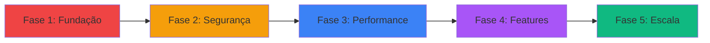

# CODM Loadouts Hub - Roadmap

## 🗺️ Visão Geral

Este roadmap define o caminho de evolução do **CODM Loadouts Hub** de um MVP funcional para uma plataforma completa e escalável para a comunidade CODM.

---

## 📅 Fases do Projeto



---

## 🔴 Fase 1: Fundação e Correções (1-2 semanas)

**Objetivo**: Corrigir problemas críticos e estabelecer base sólida

### 1.1 Segurança Crítica
- [ ] **Ajustar RLS Policies no Supabase**
  - Criar policy para verificar role de admin
  - Restringir escrita apenas para usuários autenticados
  - Implementar verificação de ownership
  ```sql
  -- Exemplo de policy correta
  create policy "Admin write streamers" 
  on streamers for all 
  using (
    auth.uid() in (
      select id from app_users where role = 'ADMIN'
    )
  );
  ```

- [ ] **Validação de Dados**
  - Adicionar validação de inputs no frontend
  - Implementar validação no backend (Supabase Functions)
  - Sanitizar dados antes de salvar
  - Validar uploads (tipo, tamanho, formato)

- [ ] **Corrigir Vulnerabilidades**
  - Executar `npm audit fix --force`
  - Atualizar dependências críticas
  - Revisar e atualizar pacotes desatualizados

### 1.2 Dados de Exemplo
- [ ] **Implementar Seed Data**
  - Usar o arquivo `seed.ts` existente
  - Criar script para popular banco de dados
  - Adicionar dados de exemplo para desenvolvimento
  - Documentar como executar o seed

### 1.3 Tratamento de Erros
- [ ] **Error Boundaries**
  - Implementar Error Boundary no React
  - Criar página de erro customizada
  - Adicionar fallback UI para componentes

- [ ] **Feedback Visual**
  - Loading states em todas as ações assíncronas
  - Toast notifications (usar biblioteca como `react-hot-toast`)
  - Confirmação antes de deletar (modal)
  - Mensagens de erro específicas

### 1.4 Documentação
- [ ] **README Melhorado**
  - Instruções de instalação detalhadas
  - Como configurar Supabase
  - Como executar seed
  - Troubleshooting comum

- [ ] **Variáveis de Ambiente**
  - Documentar todas as env vars necessárias
  - Criar `.env.example`
  - Validar env vars na inicialização

**Entregáveis**: Projeto seguro, com dados de exemplo e melhor UX

---

## 🟡 Fase 2: Segurança e Autenticação (1 semana)

**Objetivo**: Robustecer sistema de autenticação e permissões

### 2.1 Sistema de Roles
- [ ] **Implementar Roles Completos**
  - ADMIN: Acesso total
  - EDITOR: Pode criar/editar loadouts
  - USER: Apenas visualização
  - Middleware para verificar permissões

### 2.2 Autenticação Avançada
- [ ] **Melhorias no Login**
  - Recuperação de senha
  - Email de confirmação
  - Login social (Google, Discord)
  - Rate limiting no login

- [ ] **Sessão e Tokens**
  - Configurar timeout de sessão
  - Refresh token automático
  - Logout em todas as abas

### 2.3 Auditoria
- [ ] **Logs de Atividade**
  - Registrar ações administrativas
  - Histórico de mudanças
  - Quem criou/editou/deletou o quê

**Entregáveis**: Sistema de autenticação robusto e seguro

---

## 🔵 Fase 3: Performance e Otimização (1-2 semanas)

**Objetivo**: Garantir que o app escale bem com muitos dados

### 3.1 Otimização de Carregamento
- [ ] **Lazy Loading**
  - Lazy load de imagens (usar `loading="lazy"`)
  - Lazy load de vídeos (carregar sob demanda)
  - Code splitting de rotas
  - Suspense boundaries

- [ ] **Paginação**
  - Implementar paginação em loadouts
  - Infinite scroll ou "Load More"
  - Paginação no admin

### 3.2 Cache e Estado
- [ ] **Cache de Dados**
  - Implementar React Query ou SWR
  - Cache de queries do Supabase
  - Invalidação inteligente de cache

- [ ] **Otimização de Queries**
  - Revisar queries do Supabase
  - Adicionar índices no banco
  - Resolver N+1 problems
  - Usar `select` específico (não `*`)

### 3.3 Assets
- [ ] **Otimização de Mídia**
  - Comprimir imagens (WebP)
  - Comprimir vídeos
  - CDN para assets estáticos
  - Responsive images

### 3.4 Build e Deploy
- [ ] **Otimização de Build**
  - Tree shaking
  - Minificação
  - Bundle analysis
  - Preload de recursos críticos

**Entregáveis**: App rápido mesmo com milhares de loadouts

---

## 🟣 Fase 4: Features e Engajamento (2-3 semanas)

**Objetivo**: Adicionar features que aumentem engajamento

### 4.1 Sistema Social
- [ ] **Favoritos**
  - Usuários podem favoritar loadouts
  - Página "Meus Favoritos"
  - Contador de favoritos

- [ ] **Avaliações**
  - Sistema de rating (1-5 estrelas)
  - Comentários em loadouts
  - Moderação de comentários

- [ ] **Compartilhamento**
  - Botões de compartilhar (Twitter, Discord, WhatsApp)
  - Link direto para loadout
  - Preview cards (Open Graph)

### 4.2 Busca Avançada
- [ ] **Filtros Combinados**
  - Filtrar por streamer + categoria + tags
  - Ordenar por: mais recente, mais popular, mais copiado
  - Busca por texto (nome da arma, streamer)

- [ ] **Sugestões**
  - "Loadouts relacionados"
  - "Outros loadouts deste streamer"
  - "Loadouts populares desta arma"

### 4.3 Personalização
- [ ] **Perfil de Usuário**
  - Usuários podem ter perfil
  - Avatar customizável
  - Bio e redes sociais

- [ ] **Preferências**
  - Modo claro/escuro toggle
  - Idioma (PT/EN)
  - Notificações

### 4.4 Notificações
- [ ] **Sistema de Notificações**
  - Novos loadouts de streamers favoritos
  - Respostas a comentários
  - Email digest semanal

### 4.5 Analytics
- [ ] **Estatísticas Públicas**
  - Top 10 loadouts da semana
  - Streamer mais popular
  - Arma mais usada
  - Gráficos de tendências

**Entregáveis**: Plataforma engajadora com comunidade ativa

---

## 🟢 Fase 5: Escala e Profissionalização (2-4 semanas)

**Objetivo**: Preparar para crescimento e monetização

### 5.1 Testes Automatizados
- [ ] **Testes Unitários**
  - Vitest para testes de componentes
  - Testing Library para React
  - Cobertura mínima de 70%

- [ ] **Testes E2E**
  - Playwright ou Cypress
  - Fluxos críticos (login, criar loadout, copiar código)
  - Testes de regressão

### 5.2 CI/CD
- [ ] **Pipeline de Deploy**
  - GitHub Actions ou GitLab CI
  - Deploy automático em staging
  - Deploy em produção após aprovação
  - Rollback automático em caso de erro

### 5.3 Monitoramento
- [ ] **Observabilidade**
  - Sentry para error tracking
  - Google Analytics ou Plausible
  - Logs estruturados
  - Alertas de downtime

### 5.4 PWA e Mobile
- [ ] **Progressive Web App**
  - Service Worker
  - Offline mode
  - Instalável no celular
  - Push notifications

- [ ] **Responsividade Total**
  - Redesign mobile-first
  - Testes em dispositivos reais
  - Touch gestures

### 5.5 Internacionalização
- [ ] **i18n**
  - Suporte a múltiplos idiomas
  - Português (PT-BR)
  - Inglês (EN)
  - Espanhol (ES)

### 5.6 Monetização (Opcional)
- [ ] **Planos Premium**
  - Loadouts exclusivos
  - Sem anúncios
  - Estatísticas avançadas
  - Badge de apoiador

- [ ] **Parcerias**
  - Programa de afiliados para streamers
  - Patrocínios
  - Merchandise

**Entregáveis**: Plataforma escalável, testada e pronta para crescimento

---

## 🎯 Milestones

| Milestone | Prazo Estimado | Principais Entregas |
|-----------|----------------|---------------------|
| **v1.0 - MVP Seguro** | 2 semanas | RLS correto, validação, seed data |
| **v1.1 - Auth Robusto** | 3 semanas | Roles, recuperação de senha, logs |
| **v1.2 - Performance** | 5 semanas | Paginação, cache, lazy loading |
| **v2.0 - Social** | 8 semanas | Favoritos, comentários, busca avançada |
| **v3.0 - Escala** | 12 semanas | Testes, CI/CD, PWA, i18n |

---

## 📊 Métricas de Sucesso

### Técnicas
- ✅ Cobertura de testes > 70%
- ✅ Lighthouse Score > 90
- ✅ Time to Interactive < 3s
- ✅ Zero vulnerabilidades críticas

### Produto
- ✅ 1000+ loadouts cadastrados
- ✅ 50+ streamers ativos
- ✅ 10.000+ usuários mensais
- ✅ Taxa de retenção > 40%

### Negócio
- ✅ 100+ usuários premium (se aplicável)
- ✅ 5+ parcerias com streamers
- ✅ NPS > 50

---

## 🛠️ Stack Tecnológica Futura

### Possíveis Adições

| Ferramenta | Propósito | Prioridade |
|------------|-----------|------------|
| **React Query** | Cache e estado | Alta |
| **Zod** | Validação de schemas | Alta |
| **Sentry** | Error tracking | Alta |
| **Vitest** | Testes unitários | Média |
| **Playwright** | Testes E2E | Média |
| **Plausible** | Analytics privado | Média |
| **i18next** | Internacionalização | Baixa |
| **Stripe** | Pagamentos (se premium) | Baixa |

---

## 🚀 Quick Wins (Fazer Agora!)

Pequenas melhorias que trazem grande impacto:

1. ✅ **Adicionar loading spinners** (1 hora)
2. ✅ **Confirmação antes de deletar** (30 min)
3. ✅ **Toast notifications** (1 hora)
4. ✅ **Lazy load de imagens** (2 horas)
5. ✅ **Executar npm audit fix** (15 min)
6. ✅ **Criar .env.example** (10 min)
7. ✅ **Melhorar README** (1 hora)
8. ✅ **Adicionar seed data** (2 horas)

**Total**: ~8 horas para melhorias significativas!

---

## 📝 Notas Finais

> [!IMPORTANT]
> Este roadmap é **flexível** e deve ser ajustado conforme:
> - Feedback dos usuários
> - Prioridades de negócio
> - Recursos disponíveis
> - Mudanças no mercado

> [!TIP]
> **Abordagem Recomendada**: Iterativa e incremental
> - Entregar valor constantemente
> - Validar com usuários reais
> - Medir impacto de cada feature
> - Pivotar quando necessário

> [!NOTE]
> **Foco Inicial**: Segurança e Performance
> 
> Não adianta ter muitas features se o app é inseguro ou lento. Priorize a base técnica sólida antes de adicionar funcionalidades complexas.

---

## 🎉 Visão de Longo Prazo

**CODM Loadouts Hub** pode se tornar:

- 🏆 **A referência** para loadouts de CODM em português
- 🌍 **Comunidade global** de jogadores e streamers
- 💰 **Plataforma sustentável** com modelo de negócio claro
- 🚀 **Ecossistema** com API pública, bots do Discord, etc.

**O céu é o limite!** 🌟
